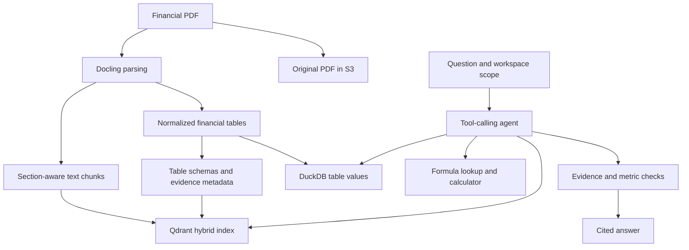

# fin-RAG

**Agentic question answering over financial reports, with hybrid retrieval, structured table queries, and source citations.**

fin-RAG helps users investigate financial filings through natural-language questions. It retrieves narrative evidence, inspects financial tables, and performs calculations before generating a cited answer. The project focuses on preserving the reporting period, units, scope, and metric definitions needed to interpret financial data correctly.

## Interface preview


## Capabilities

- **Financial PDF ingestion:** Docling parsing, section-aware chunking, page metadata, and structured table extraction.
- **Hybrid search:** dense embeddings and BM25 in Qdrant, combined through reciprocal rank fusion and cross-encoder reranking.
- **Exact table inspection:** searchable table metadata in Qdrant and extracted values in DuckDB for schema inspection and SQL queries.
- **Tool-calling agent:** narrative search, table search, financial formulas, deterministic arithmetic, and bounded retries.
- **Evidence validation:** checks for metric conventions and citation presence, supported by agent self-evaluation.
- **Application backend:** FastAPI, JWT authentication, workspace-scoped document access, uploads, background ingestion, and streaming agent events.

Example questions include comparing revenue across reporting periods, explaining changes in operating margins, and calculating a ratio from a company's balance sheet.

## Architecture

The ingestion pipeline maintains two representations of a filing: narrative chunks for semantic retrieval and structured tables for exact inspection.



PostgreSQL stores users, workspaces, and document metadata. FastAPI coordinates authentication, document processing, retrieval, and agent execution. The Chainlit interface in `ui/app.py` supports uploads, chat, live tool traces, and source links.

### Why preserve tables separately?

A searchable summary can omit a row, flatten a nested header, or lose a unit. fin-RAG indexes a table's schema, source page, evidence identifier, and sample content while retaining extracted values in DuckDB. The agent can first discover a relevant table, then inspect its columns and query the required values.

This preserves more evidence than relying on table summaries alone, although extraction and interpretation can still fail.

### Agent tools

| Tool | Purpose |
| --- | --- |
| `search_text` | Retrieve narrative evidence and neighboring chunks |
| `search_tables` | Find relevant table identifiers and schema metadata |
| `describe_table` | Inspect exact columns and a bounded preview |
| `execute_sql` | Query accessible tables through guarded, read-only SQL |
| `get_financial_formula` | Retrieve metric definitions and required components |
| `calculate` | Perform deterministic arithmetic |

The runner limits tool turns and output size, tracks repeated calls, and can request targeted repairs after validation failures. These controls reduce specific failure modes; they do not guarantee a correct answer.

## Evaluation

The following results come from the project's manually audited July 2026 evaluation, as documented in the technical overview and business presentation. They describe the evaluated development version; the benchmark has not been rerun during preparation of this README.

| Measure | Result | Interpretation |
| --- | --- | --- |
| Held-out strict answer accuracy | **68.9% (31/45)** | Primary estimate for unseen questions |
| Full-set strict answer accuracy | 76.0% (79/104) | Includes 59 development questions |
| Expected-document citation rate | 94.2% | Correct source document, not necessarily a correct answer |
| Expected-page or adjacent-page coverage | 49.0% to 80.8% | Standalone top-8 retrieval versus evidence reached across agent calls |
| Mean response time | Approximately 46 seconds | Observed evaluation workload |
| Mean token usage | Approximately 74.8K per question | 72.6K input and 2.2K output |

The evaluated setup used GPT-5 mini with low reasoning effort, `text-embedding-3-large`, and a CPU MiniLM cross-encoder. The current configuration also defaults to GPT-5 mini with low reasoning effort. Reproducing the figures requires matching the dataset, ingestion state, configuration, and manual grading protocol.

### What the error analysis showed

Of 23 answers classified as strict errors, 21 still cited the correct filing. The main problems occurred after document retrieval: selecting the wrong row, period, or scope; inconsistent reasoning; and incorrect metric, sign, or unit interpretation. The automated judge accepted 10 of those 23 errors, which is why manual review is the primary quality measure.

The audit reports 79 strictly correct answers and 23 strict errors out of 104 cases. Those counts leave two cases outside these reported categories; they are not counted as strictly correct here.

These results are not a controlled comparison against other systems or a completed run of the full 150-question public evaluation set. The repository includes evaluation scripts and question files under `app/scripts/` and `evaluation/data/`. Complete manual audit records for the reported run are not included in this snapshot.

## Getting started

The repository includes a FastAPI backend, Chainlit UI, storage services, migrations, and evaluation scripts. Both application Dockerfiles use Python 3.12.

The instructions below were checked against the merged `main` revision `8d82ffb`; a complete Docker startup and benchmark run have not been performed for this README.

### 1. Clone and configure

```bash
git clone https://github.com/V-Vitaliy/fin-RAG.git
cd fin-RAG
cp .env.example .env
```

Edit `.env` before starting the application:

| Variable | Local Docker configuration |
| --- | --- |
| `JWT_SECRET_KEY` | Set a long random secret |
| `CHAINLIT_AUTH_SECRET` | Set a separate long random secret |
| `OPENAI_API_KEY` | Set your API key |
| `QDRANT_URL` | `http://qdrant:6333` for the bundled service |
| `QDRANT_API_KEY` | Leave empty for local Qdrant; set for a configured cloud instance |
| `FIN_RAG_API_BASE_URL` | Add `http://api:8000/api/v1` for the UI container |
| `RAG_RERANKER_MODE` | `cpu_light` to use the CPU MiniLM reranker |

Keep the example's `POSTGRES_URL` and `S3_ENDPOINT_URL` container hostnames for Docker. The UI client reads **`FIN_RAG_API_BASE_URL`**, so add that variable even though the supplied example and Compose file also contain `BACKEND_BASE_URL`.

The Compose file uses local development credentials for PostgreSQL and MinIO. Keep `.env` out of version control. The default embedding and agent configuration sends relevant document text to the external model provider.

### 2. Start storage and build the application

```bash
docker compose up -d postgres qdrant minio minio-init
docker compose build api ui
```

Wait for PostgreSQL, Qdrant, and MinIO to become ready. The `minio-init` service creates the configured bucket automatically. Check readiness with `docker compose ps` and inspect service logs if needed.

### 3. Apply migrations and start the application

```bash
docker compose run --rm api alembic upgrade head
docker compose run --rm api python -m app.scripts.ensure_global_workspace
docker compose up -d api ui
```

The global-workspace command initializes the workspace configured by `RAG_GLOBAL_WORKSPACE_ID` in `.env.example`.

| Service | Local URL |
| --- | --- |
| Chainlit UI | http://localhost:8001 |
| FastAPI documentation | http://localhost:8000/docs |
| MinIO console | http://localhost:9001 |
| Qdrant | http://localhost:6333 |

Initial startup and ingestion may download model assets. Register through the API's `/api/v1/auth/register` endpoint, then use those credentials to sign in to the UI. Upload a financial PDF and wait for ingestion to complete before asking questions.

### Configuration

Additional settings are defined in [`app/core/config.py`](app/core/config.py). The default retrieval pipeline uses `text-embedding-3-large` with 3,072 dimensions, BM25, and cross-encoder reranking. Changing the embedding model or dimensions requires a compatible vector collection and reindexing.

The repository also provides `docker-compose.prod.yml`, `.env.prod.example`, and deployment scripts under `deploy/scripts/` for the deployment workflow.

## API workflow

All routes use the `/api/v1` prefix. Register, log in, and pass the returned access token as `Authorization: Bearer <token>` for protected requests.

| Method | Route | Purpose |
| --- | --- | --- |
| POST | `/auth/register` | Create a user and workspace |
| POST | `/auth/login` | Obtain an access token |
| GET | `/auth/me` | Inspect the authenticated user |
| POST | `/documents` | Upload a document using multipart field `file` |
| GET | `/documents/{document_id}` | Check ingestion status |
| POST | `/rag/ask` | Return an answer and tool-call trace |
| POST | `/rag/ask/stream` | Stream agent events through SSE |
| POST | `/rag/search/text` | Inspect narrative retrieval |
| POST | `/rag/search/tables` | Inspect table retrieval |

Wait until the uploaded document is ready before asking questions. An example request body for `/rag/ask` is:

```json
{
  "question": "What drove the change in operating margin between the reported years?"
}
```

Use the optional `document_ids` array to restrict the request to particular accessible documents.

## Tests

The repository includes unit tests for authentication, routes, ingestion, retrieval, and agent behavior, plus integration tests for storage and external-service workflows.

For a local Python 3.12 environment with the project dependencies installed and `.env` configured:

```bash
python -m pytest tests/unit
python -m pytest tests/integration
```

When running outside Docker, replace container hostnames with `localhost` and use writable local paths for DuckDB and agent traces. The API image currently does not copy the test directory, so these commands target a local checkout.

Integration tests can require running services, model downloads, and real API credentials. These commands have not been executed as part of preparing this README.

## Next steps

- Publish complete manual audit records and a fixed configuration for reproducing the reported evaluation.
- Validate selected evidence against the question's reporting period, scope, and units before synthesis.
- Strengthen consistency checks between evidence, calculations, and conclusions.
- Reduce repeated context and near-duplicate searches to lower latency and token usage.
- Complete the full public evaluation set under one fixed protocol.

## Author

[Vitaliy Kovalenko](https://github.com/V-Vitaliy) · [LinkedIn](https://www.linkedin.com/in/vitaliy-kovalenko-989101331/)
